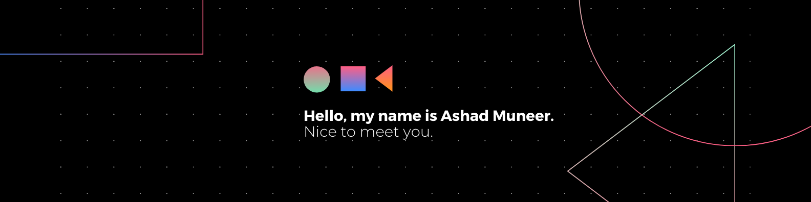

# Hi there, I'm Ashad Muneer 👋

## 🚀 About Me
I am a passionate **Frontend Developer** and **UI/UX Designer** with a strong foundation in web development. I am currently pursuing my **B.Tech in Computer Science and Engineering** at ABES Engineering College. I love creating responsive, user-friendly web applications and working on open-source projects.

### 💻 Technologies & Tools:
- **Languages**: HTML, CSS, JavaScript, C/C++, MySQL
- **Frameworks & Libraries**: React.js, Node.js, Tailwind CSS, Bootstrap, Redux
- **Tools & Platforms**: Git, GitHub, Firebase, AWS, Postman, Mapbox, Figma, Adobe XD
- **Database**: MongoDB, MySQL
- **Version Control**: Git, GitHub Actions
- **OS**: Linux, Windows

## 🌱 What I'm Learning
- **Advanced React.js** for building dynamic, interactive UIs.
- **UI/UX Design** for creating intuitive and seamless user experiences.
## 🔰 Holopin Badge Board

## 📈 GitHub Stats

  <!-- GitHub Stats Card -->
  
  <!-- GitHub Languages -->
  
   <!-- GitHub Streak -->
  

## 📝 Featured Projects:
- **[Pop Crat](https://github.com/ashadmuneer/PopCrat)** - Fashion e-commerce platform built with React.js, Node.js, Express.js, MongoDB, and PayPal integration for payment handling.
- **[ChitChat](https://github.com/ashadmuneer/ChitChat)** - Real-time chat application using React.js and Firebase, with features like media sharing and real-time notifications.
- **[Vajra](https://github.com/ashadmuneer/Vajra)** - Interactive medical emergency solutions platform built with React.js, offering quick access to emergency services.

## 💬 Let's Connect:
- [LinkedIn](https://www.linkedin.com/in/ashad-muneer)
- [Email](mailto:ashadmuneerofficial@gmail.com)
- [Personal Website](https://ashadmuneer.netlify.app)

Feel free to reach out if you're interested in collaborating or just want to chat about tech!
